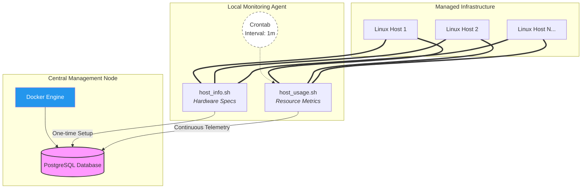

# Jarvis Remote Host Monitoring Agent

## Overview

The **Jarvis Remote Host Monitoring Agent** is a professional-grade infrastructure monitoring system designed to automatically collect hardware specifications and real-time resource utilization from distributed Linux servers.

It follows a lightweight **agent-based architecture**, where each node runs simple Bash scripts that push system telemetry to a centralized **PostgreSQL** database running inside **Docker**. This solution enables System Administrators and DevOps Engineers to monitor server health, detect performance bottlenecks, and make data-driven scaling decisionswithout manual checks.

## Key Capabilities
- Automatic hardware inventory
- Continuous resource monitoring (CPU, memory, disk)
- Centralized PostgreSQL data store
- Cron-based automation
- SQL-based analytics for operational insights

---

## Technology Stack

| Component     | Purpose |
|--------------|---------|
| **Bash**     | System metric collection & parsing |
| **Docker**   | PostgreSQL container management |
| **PostgreSQL** | Telemetry data storage |
| **Git**      | Version control & collaboration |
| **Crontab**  | Automated metric scheduling |

---

## System Architecture

The system uses a **hub-and-spoke** model:

- **Agent Nodes**  
  Each server runs lightweight Bash scripts to collect system metrics.

- **Central Database Node**  
  A Dockerized PostgreSQL instance stores all telemetry data.

Each agent independently pushes data to the same database endpoint over the network.


---

## Quick Start
Follow these steps to initialize your monitoring environment:

```bash
# 1. Provision the PostgreSQL container
./scripts/psql_docker.sh create [db_username] [db_password]

# 2. Initialize the database schema
psql -h localhost -U postgres -d host_agent -f sql/ddl.sql

# 3. Register the host hardware specifications
./scripts/host_info.sh "localhost" 5432 "host_agent" "postgres" "password"

# 4. Execute a manual usage data collection
./scripts/host_usage.sh "localhost" 5432 "host_agent" "postgres" "password"

# 5. Automate collection via Crontab
crontab -e
# Add the following line to sync every minute:
# * * * * * bash /absolute/path/to/host_usage.sh "localhost" 5432 "host_agent" "postgres" "password" > /tmp/host_usage.log 2>&1
```

---
