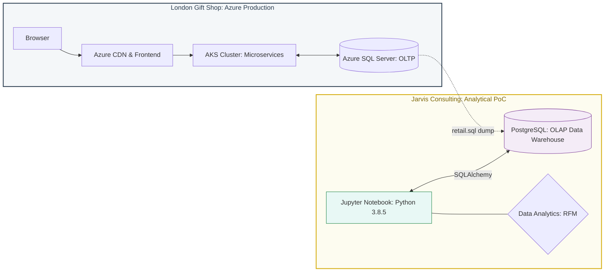

# Introduction
As a Data Engineer at Jarvis Consulting, I conducted a Proof of Concept (PoC) for London Gift Shop (LGS), a UK-based retailer. This project bridges the gap between raw transactional data and actionable marketing insights using a Docker-based ETL and analytics pipeline. By transitioning LGS from generic sales tactics to data-driven strategies, this analysis enables precision targeting for customer acquisition and retention.

Work and Technologies: I am developing an ETL (Extract, Transform, Load) and analytics pipeline using Python and Pandas for data manipulation, and Numpy for numerical analysis. My entire workflow is managed within Jupyter Notebooks, and I am using Docker to maintain a consistent environment across the project.

# Implementation
## Project Architecture
The architecture is designed to be decoupled from the LGS production environment to meet security requirements.It utilizes a Docker-based setup where a PostgreSQL container stores the sanitized transaction data, and a Jupyter container serves as the development interface. These containers communicate via a bridge network, allowing me to process the SQL dump provided by the LGS IT team without touching their live Azure cloud.

#### Architecture Component Breakdown
- Production Stack: LGS utilizes a high-availability Azure environment where a CDN handles the frontend, and an AKS Cluster (Kubernetes) manages microservices interacting with a live Azure SQL Server (OLTP).
- The Data Bridge: To maintain security and stability, we do not connect directly to the cloud. Instead, we utilize a retail.sql dump to transition data from the production OLTP system to our local environment.
- Containerized Analytics (Docker): Our environment runs two distinct Docker containers:
    1. PostgreSQL (OLAP): Acts as the local data warehouse for all transformed retail data.
    2. Jupyter Notebook: A specialized data science image (python-3.8.5) where we execute the ETL pipeline and RFM segmentation using Pandas and SQLAlchemy.

## Architecture Diagram

## Data Analytics and Wrangling
I am using the data to perform RFM (Recency, Frequency, Monetary) Segmentation, which is the primary strategy for increasing revenue.
The primary analytical framework used is RFM (Recency, Frequency, Monetary) segmentation, which categorizes customers based on their historical behavior.
 
#### Recency:
1. Recency: Measures the days since the customer's last purchase.
2. Calculation: We establish a snapshot_date (assumed Jan 1, 2012) and subtract the customer's most recent purchase date from it.
3. Marketing Significance: Low recency indicates active engagement, while high recency signals "At-Risk" or "Hibernating" status.

#### Frequency
1. Measures how often a customer completes a transaction.
2. Calculation: Uses the nunique function on invoice IDs to count unique checkout events rather than total items purchased.
3. Marketing Significance: High frequency identifies "Habitual Buyers" who should be targeted with loyalty incentives.

#### Monetary
1. Measures the total revenue generated by a customer.
2. Calculation: Derived from line_total ($Quantity \times UnitPrice$).
3. Marketing Significance: Distinguishes between "Whale" customers (High M) and small retail hobbyists (Low M).

##  London Gift Shop RFM Segmentation and Market Significance
| Segment | Count | Recency (Mean) | Frequency (Mean) | Monetary (Mean) | Customer Behaviour | Marketing Strategy |
|--------|-------|----------------|------------------|-----------------|-------------------|-------------------|
| Hibernating | 1,522 | 481.01 days | 1.25 | £437.96 | **Inactive & Low Value:** Long-term inactivity with minimal historical engagement and spending. | **Minimal Spend:** Use low-cost broad campaigns or automated last chance reminders. |
| Loyal Customers | 1,147 | 89.31 days | 9.80 | £4,199.73 | **Consistent Backbones:** Frequent repeat buyers who demonstrate strong brand trust and reliable revenue. | **Retention & Upsell:** Reward loyalty with exclusive offers and personalized thank you gestures. |
| Champions | 852 | 30.25 days | 19.21 | £10,795.52 | **The Whales:** Highly active, top spenders, and reliable brand advocates. | **VIP Treatment:** Prioritize with early access to new products and premium engagement programs. |
| At Risk | 750 | 394.94 days | 3.90 | £1,383.60 | **Fading Value:** Previously valuable customers showing clear signs of long-term disengagement. | **Win-Back:** Run aggressive win-back campaigns with targeted, high-value incentives. |
| Potential Loyalists | 713 | 47.30 days | 2.59 | £1,155.43 | **Growing Assets:** Recently engaged customers with high potential to become habitual buyers. | **Nurture:** Encourage repeat purchases via tailored recommendations and onboarding offers. |
| About to Sleep | 388 | 128.62 days | 1.36 | £531.97 | **Early Churn Risk:** Activity is declining; they are on the verge of becoming inactive. | **Reactivation:** Deploy nudges, reminders, and limited-time incentives to spark activity. |
| Need Attention | 269 | 135.24 days | 3.16 | £1,283.11 | **Momentum Loss:** Moderately engaged customers whose purchase frequency is slowing down. | **Stimulate:** Use personalized messaging to re-establish a consistent purchasing habit. |
| Promising | 110 | 60.28 days | 1.00 | £324.50 | **Testing the Waters:** New or low-frequency buyers who have engaged recently. | **Onboarding:** Nurture with introductory offers to build a long-term relationship. |
| Can't Lose | 71 | 352.80 days | 15.93 | £8,355.68 | **High-Value Churn:** Former Whale customers who have gone silent; high risk of permanent loss. | **High-Touch:** Aggressive retention with high-touch, highly personalized outreach or gifts. |
| New Customers | 56 | 32.30 days | 1.00 | £356.26 | **Exploratory:** First-time buyers who have made a very recent initial purchase. | **Habit Building:** Integrate into welcome journeys to secure a second purchase. |

#### Marketing Signficance:
Low Recency Value: Indicates an active, "fresh" customer who has purchased very recently. They should be targeted with loyalty rewards or new product announcements.

High Recency Value: Indicates a customer who has not purchased in a long time. These customers are categorized as "At-Risk" or "Hibernating" and require different strategies, such as aggressive re-engagement discounts, to bring them back to the store.

High Frequency: Suggests a "Habitual Buyer" or a reliable wholesaler who has integrated LGS into their own supply chain. The marketing team should offer "Frequency Incentives," such as a loyalty card or a "Buy 5, Get 10% Off Your 6th Order" promotion to push them into the high-frequency category.

Low Frequency: Suggests "One-off" gift buyers or new customers who have not yet committed to the brand. These customers need "Welcome Back" education. Send them content about the variety of products LGS offers to show that the shop isn't just for one specific occasion.

For High Monetary: LGS should provide "White Glove Service." This includes dedicated account managers, early access to new stock, or bulk-buy discounts that aren't available to the general public.

For Low Monetary: The goal here is to increase the Average Order Value (AOV). The marketing team can use "Upsell" strategies, such as "Free shipping on orders over £50" or "Recommended Add-ons" during the checkout process.

By categorizing customers into segments like "Champions" or "At-Risk," I provide the marketing team with the exact list of users who need either loyalty rewards or re-engagement discounts. Additionally, my analysis of monthly sales growth and user retention patterns helps LGS identify which seasons or product types are underperforming.

## Improvements
Real-time Integration: Transition from static SQL/CSV dumps to a live data stream from the LGS Azure environment using Azure Data Factory for up-to-the-minute marketing insights.

Predictive Analytics: Implement Machine Learning models to forecast future sales and predict customer churn, allowing the marketing team to act before a high-value wholesaler leaves.

Automated Visualization: Deploy an interactive Power BI or Streamlit dashboard so the LGS marketing team can explore the data themselves without needing to run code.
