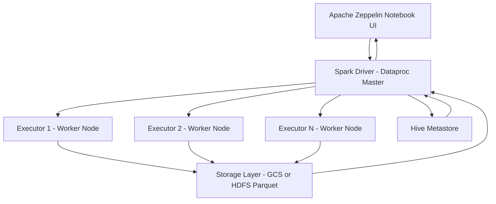

# Retail Data Analytics with PySpark (Databricks)

# Zeppelin and Hadoop Implementation

## Dataset and Analytics Work

This project analyzes **GDP growth data** using the `wdi_csv_parquet` dataset, which is derived from the World Development Indicators (WDI). The dataset is stored in **Parquet format**, enabling efficient distributed querying.

The analytics work was performed using **Apache Zeppelin with PySpark** on a Hadoop-based cluster (Google Cloud Dataproc). The following key analyses were conducted:

- Extracting GDP growth data for Canada
- Cleaning and standardizing string fields (using `TRIM`, `LOWER`)
- Ordering GDP growth data year-wise
- Extracting GDP growth data for all countries
- Performing distributed sorting and partitioning using `DISTRIBUTE BY` and `SORT BY`
- Identifying the year of maximum GDP growth for each country

These queries leverage **Spark SQL** and are executed in a distributed manner across the cluster.

> ?? Zeppelin notebook link: *(Add your exported notebook or Git link here)*

---

## Architecture

The system follows a distributed data processing architecture using Hadoop and Spark:

- **Data Source**: WDI dataset stored in Parquet format (on Google Cloud Storage or HDFS)
- **Processing Engine**: Apache Spark (via PySpark)
- **Notebook Interface**: Apache Zeppelin
- **Cluster Management**: Google Cloud Dataproc (Hadoop + Spark cluster)
- **Storage Layer**: HDFS / Google Cloud Storage
- **Metadata Layer**: Hive Metastore (for table `wdi_csv_parquet`)
- **Execution Flow**:
  1. Zeppelin sends PySpark queries
  2. Spark Driver processes query plan
  3. Tasks distributed across worker nodes
  4. Results returned to Zeppelin (`z.show()`)

---

## Architecture Diagram



### Zeppelin notebook queries 
## PySpark Query

## Fetching GDP Growth Data using PySpark

```python
df = spark.sql("""
    SELECT * FROM wdi_csv_parquet 
    WHERE countryname='Canada' 
    AND indicatorcode='NY.GDP.MKTP.KD.ZG'
""")

z.show(df)
```

## Fetching canada growth year by year

```python
wdi_canada_df = spark.sql("""
SELECT year, indicatorvalue
FROM wdi_csv_parquet
WHERE TRIM(indicatorcode) = 'NY.GDP.MKTP.KD.ZG' 
AND LOWER(TRIM(countryname)) = 'canada'
ORDER BY year
""")

z.show(wdi_canada_df.select("year", "indicatorvalue"))
``` 

## Fetching GDP Growth Data for All Countries (Distributed and Sorted)

```python
wdi_all_countries_df = spark.sql("""
SELECT countryname,
       year,
       indicatorcode,
       indicatorvalue
FROM wdi_csv_parquet
WHERE TRIM(indicatorcode) = 'NY.GDP.MKTP.KD.ZG'
DISTRIBUTE BY countryname
SORT BY countryname, year
""")

z.show(wdi_all_countries_df.select("countryname", "year", "indicatorcode", "indicatorvalue"))
```

## Finding Maximum GDP Growth Year for Each Country

```python
wdi_max_gdp_df = spark.sql("""
SELECT wdi_csv_parquet.indicatorvalue AS value, 
       wdi_csv_parquet.year AS year, 
       wdi_csv_parquet.countryname AS country 
FROM (
    SELECT MAX(indicatorvalue) AS ind, countryname 
    FROM wdi_csv_parquet 
    WHERE indicatorcode = 'NY.GDP.MKTP.KD.ZG' 
    AND indicatorvalue <> 0 
    GROUP BY countryname
) t1 
INNER JOIN wdi_csv_parquet 
ON t1.ind = wdi_csv_parquet.indicatorvalue 
AND t1.countryname = wdi_csv_parquet.countryname
""")

z.show(wdi_max_gdp_df.select("country", "year", "value"))
```

