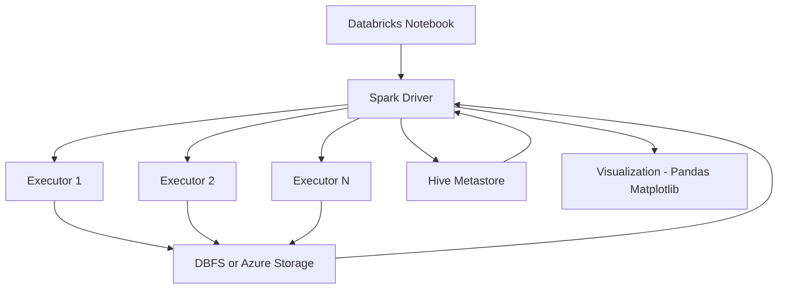
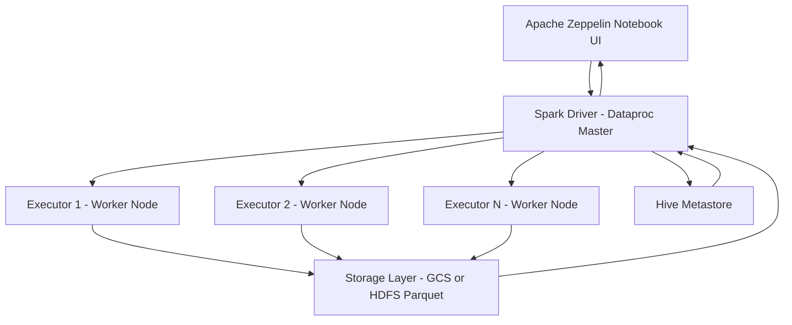

# Introduction

## Business Context
This project analyzes large-scale economic and retail data to extract insights such as GDP trends and transaction patterns using distributed processing.

## Work and Technologies
Analysis was performed using **PySpark** on:
- **Apache Zeppelin (Google Cloud Dataproc - Hadoop)**
- **Azure Databricks**

Datasets:
- GDP data (WDI)
- Retail transactions

Technologies:
- Spark SQL, PySpark  
- Zeppelin, Databricks  
- Hadoop, Azure  
- Hive Metastore, Parquet

# Databricks and Hadoop Implementation

## Dataset and Analytics
Analyzed retail transaction data (`retail` table) using **PySpark in Databricks**.

Key tasks:
- Loaded data from Hive Metastore (`jarvis_training.default.retail`)
- Renamed and cleaned columns
- Created derived fields (`line_item_total`, `year_month`)
- Identified cancelled orders
- Monthly aggregation of orders
- Invoice-level aggregation (total invoice amount)
- Distribution analysis using percentiles (85th quantile)
- Converted Spark DataFrames to Pandas for visualization

Notebook link: spark/notebook/Retail Data Analytics with PySpark.ipynb
---

## Architecture
- **Platform**: Azure Databricks  
- **Compute**: Apache Spark (PySpark)  
- **Storage**: DBFS / Azure Data Lake Storage  
- **Metadata**: Hive Metastore  
- **Processing Flow**:  
  Databricks Notebook ? Spark Driver ? Executors (parallel processing) ? DBFS / ADLS ? Results ? Visualization (Pandas/Matplotlib)

---

## Architecture Diagram



# Zeppelin and Hadoop Implementation
## Dataset and Analytics
Analyzed GDP growth data (`wdi_csv_parquet`) from World Development Indicators using **PySpark in Apache Zeppelin** on **Google Cloud Dataproc**.

Key tasks:
- Filtered Canada GDP growth
- Cleaned data (`TRIM`, `LOWER`)
- Year-wise ordering
- All-country GDP extraction
- Distributed sorting (`DISTRIBUTE BY`, `SORT BY`)
- Max GDP growth year per country

---

## Architecture
- **UI**: Apache Zeppelin  
- **Compute**: Apache Spark (PySpark)  
- **Cluster**: Google Cloud Dataproc (Hadoop)  
- **Storage**: GCS / HDFS (Parquet)  
- **Metadata**: Hive Metastore  

**Flow**: Zeppelin ? Spark Driver ? Executors (parallel) ? Storage ? Result back to Zeppelin


## Architecture Diagram



### Zeppelin notebook queries 
## PySpark Query

## Fetching GDP Growth Data using PySpark

```python
df = spark.sql("""
    SELECT * FROM wdi_csv_parquet 
    WHERE countryname='Canada' 
    AND indicatorcode='NY.GDP.MKTP.KD.ZG'
""")

z.show(df)
```

## Fetching canada growth year by year

```python
wdi_canada_df = spark.sql("""
SELECT year, indicatorvalue
FROM wdi_csv_parquet
WHERE TRIM(indicatorcode) = 'NY.GDP.MKTP.KD.ZG' 
AND LOWER(TRIM(countryname)) = 'canada'
ORDER BY year
""")

z.show(wdi_canada_df.select("year", "indicatorvalue"))
``` 

## Fetching GDP Growth Data for All Countries (Distributed and Sorted)

```python
wdi_all_countries_df = spark.sql("""
SELECT countryname,
       year,
       indicatorcode,
       indicatorvalue
FROM wdi_csv_parquet
WHERE TRIM(indicatorcode) = 'NY.GDP.MKTP.KD.ZG'
DISTRIBUTE BY countryname
SORT BY countryname, year
""")

z.show(wdi_all_countries_df.select("countryname", "year", "indicatorcode", "indicatorvalue"))
```

## Finding Maximum GDP Growth Year for Each Country

```python
wdi_max_gdp_df = spark.sql("""
SELECT wdi_csv_parquet.indicatorvalue AS value, 
       wdi_csv_parquet.year AS year, 
       wdi_csv_parquet.countryname AS country 
FROM (
    SELECT MAX(indicatorvalue) AS ind, countryname 
    FROM wdi_csv_parquet 
    WHERE indicatorcode = 'NY.GDP.MKTP.KD.ZG' 
    AND indicatorvalue <> 0 
    GROUP BY countryname
) t1 
INNER JOIN wdi_csv_parquet 
ON t1.ind = wdi_csv_parquet.indicatorvalue 
AND t1.countryname = wdi_csv_parquet.countryname
""")

z.show(wdi_max_gdp_df.select("country", "year", "value"))
```

